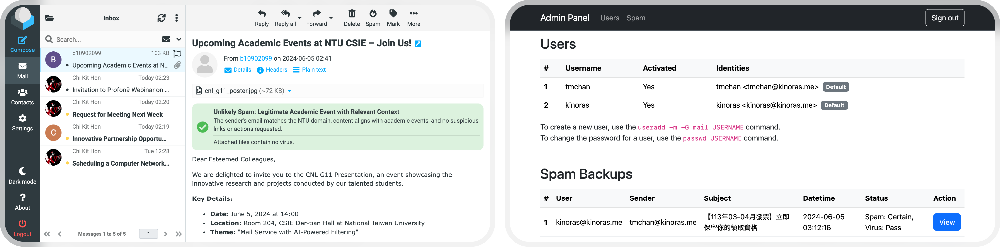
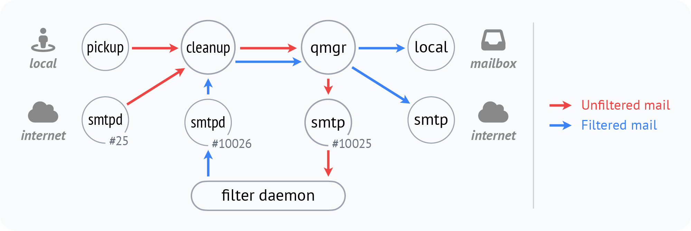

# Mailsafe - Mail Service with AI-Powered Filtering

## 📝 Overview

**Mailsafe** is an **AI-enhanced email filtering service** aiming to address the pervasive problem of spam and malicious emails. It offers the following features:

- **Server-side:**

  - **Content filtering** - Use GPT-4o for spam checking
  - **Virus scanning** - Use ClamAV to detect malware
  - **Spam mail backup** - For auditing or legal evidence

- **Client-side:**

  - **Sender avatar** - Gravatar integration for quick sender identification
  - **Spam warning** - Display alert for spam mails
  - **Admin panel** - For easier user management

## 🚀 Setup & Deployment

To set up this project and explore its features interactively, refer to the detailed [setup guide](./docs/setup.md).

## 🧱 System Architecture

> **Note:**
> Before proceeding, a basic understanding of email systems is recommended.
> If you're unfamiliar, you can check out [this introduction article](./docs/basics.md) for a foundational overview.

### Platform

The system is built on **Ubuntu 20.04 within Docker**.

Docker offers a **lightweight** and **portable** environment, providing **isolation** between services, **simplifying rollbacks** when needed. It also supports **automated builds** via Dockerfiles, which makes the development processes easier.

### MTA: Postfix

We chose Postfix for its flexibility and widespread adoption (more resources). The workflow of Postfix was modified to include an additional filtering process, ensuring that every incoming and outgoing email is inspected.

The **filter daemon**, implemented as a Python script, performs the following steps:

1. **Decoding:**
   Parse binary data into a string, then extract the subject, sender, body and attachments.
2. **Inspection:**
   Analyze text using GPT-4o, scan attachments with ClamAV, and verify DKIM signatures.
3. **Backup:**
   Create copies of suspicious emails.
4. **Appending headers:**
   Add spam and virus information to the headers, along with a hash value to prevent tampering.
5. **Encoding:**
   Reassemble the email with custom headers appended.
6. **Sending:**
   Re-enqueue the email for delivery by forwarding it to port 10026.

### LDA: Dovecot

Although Postfix includes a built-in LDA, we opted for Dovecot due to its support for **Sieve extensions**, which allow more flexible handling of emails based on their spam risk levels. Specifically:

- **Discard** emails classified as definite spam:

  - Spam probability ≥ 90%

- **Move to Junk folder** for suspicious emails:

  - Spam probability ≥ 60%
  - Contains infected attachments
  - Fails DKIM verification

### MUA: Roundcube

We selected Roundcube for its user-friendly web-based interface, plugin support, and extensive customisation capabilities. Using a [custom plugin](https://github.com/kinoras/rcplus), we introduced the following features:

- **User Avatar:**

  - Retrieve the sender’s name and email address.
  - Display the sender’s Gravatar, or the first letter in the name if unavailable.
  - Mark spammers with exclamation marks.

- **Spam Warning:**

  - Analyse the email headers.
  - Display banners to explain spam risk levels.

## 📊 Performance

The system was evaluated using the **SpamAssassin** public corpus, consisting of 1,682 emails.

While effective at identifying spam, the system struggles to achieve the right balance between detecting spam and minimising false positives. Currently, the **balanced accuracy is approximately 70%**, likely due to suboptimal AI prompt design and the lack of model fine-tuning.

For detailed metrics and analysis, refer to [this docment](docs/performance.md).

## 🔮 Future Steps

- **Model Enhancement:**

  - Fine-tuning the existing model.
  - Training a specialised model for improved accuracy.

- **Enhanced Authentication Methods:**

  - SPF checking - Currently unable to reliably retrieve the sender’s IP address.
  - DKIM headers - Outgoing mail DKIM signing is yet to be implemented.

- **Spam Feedback:**

  - Adding a “Report Spam” button to help improving models.

## 🙇‍♂️ Acknowledgement

Special thanks to [Miroslav Houdek](https://github.com/MiroslavHoudek) for creating the foundation of the Python filter script.
