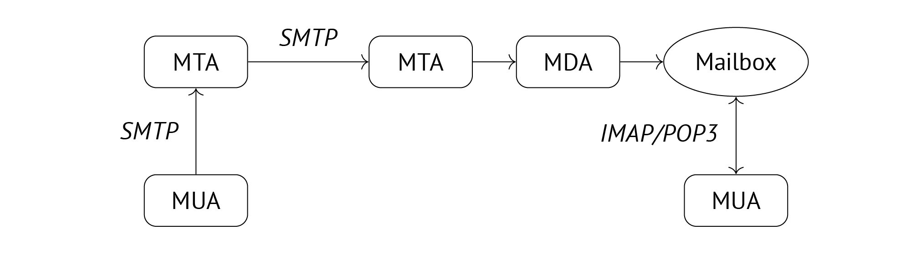

# 🔰 Email System 101

> **Note:**  
> This content of this document is mainly adapted from the
> final project report.

## Overview

The email system works much like the postal service in
reality. It works through a network of components, each
handling specific tasks, to ensure the successful delivery
and management of mails.

The figure above shows the flow and components involved in
the transmission of an email. Understanding these elements
is crucial before undertaking any development efforts.

The table below lists the acronyms and abbreviations used
in this document.

| Acronym | Description                                                     |
| ------- | --------------------------------------------------------------- |
| DKIM    | DomainKeys Identified Mail                                      |
| DMARC   | Domain-based Message Authentication, Reporting, and Conformance |
| DNS     | Domain Name System                                              |
| IMAP    | Internet Message Access Protocol                                |
| LDA     | Local Delivery Agent (Local MDA)                                |
| MDA     | Mail Delivery Agent                                             |
| MTA     | Mail Transfer Agent                                             |
| MUA     | Mail User Agent                                                 |
| POP3    | Post Office Protocol version 3                                   |
| SMTP    | Simple Mail Transfer                                            |
| SPF     | Sender Policy Framework                                         |

## Mail User Agent (MUA)

MUAs enable users to compose and send emails to
any recipients. When a user clicks the “send” button,
the MUA transmits the message to an MTA via SMTP
for delivery. Additionally, MUAs can retrieve incoming
emails from mailboxes using POP3 or IMAP protocols.

Common MUAs include Outlook, Gmail, Roundcube, and
Thunderbird.

## Mail Transfer Agent (MTA)

MTAs receive mails from MUAs or other MTAs, make
transfer decisions, and then pass them to MDAs for further
delivery. In case the recipient’s address is invalid, an error
message is sent back to the sender [1], and the mail is put
into the deferred queue for later delivery attempts [2].

Common MTAs include Sendmail, Exim and Postfix.

## Mail Delivery Agent (MDA)

MDAs receive mails from MTAs and deliver them to
either local mailboxes or other MTAs. Local MDAs, also
known as LDAs, can perform local mail filtering,
put mails into different folders, and set unread
flags.

Common MDAs include Procmail and Dovecot, while Sieve
is a commonly used email filtering language.

## Email Validation

SPF, DKIM, and DMARC are used to ensure the authenticity
and integrity of an email:

- **SPF** verifies that the email is sent from a legitimate
  server, in order to prevent sender address forgery.

- **DKIM** ensures the email’s content remains untampered and
  authentic through asymmetric encryption.
- **DMARC** specifies how to handle emails that fail SPF or
  DKIM checks, with each domain setting potentially varying.
  For instance, government agencies might configure stricter
  DMARC policies to prevent impersonation attempts.

The information required for verification, such as IP
addresses of legitimate servers, the public key for DKIM,
and DMARC handling policies, is all presented as
_DNS records_. This approach provides a standardised and
accessible way for verifying email legitimacy, enhancing
overall email security and reliability.

## Reference

1. _Programming Internet Email: Mastering Internet Messaging Systems._  
   David Wood. O’Reilly Media, 1999.

2. _Postfix Bottleneck Analysis._
   ([Link](https://www.postfix.org/QSHAPE_README.html#deferred_queue))  
   Postfix. Visited on 05/29/2024.
