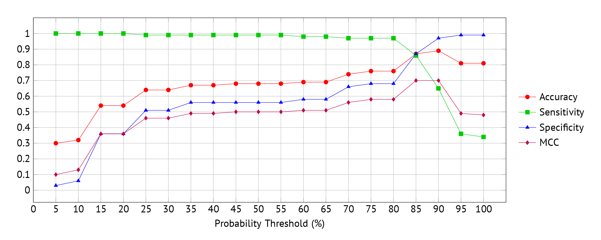

# 📊 Performance

## Benchmark

The performance was evaluated using the **SpamAssassin** public mail corpus dataset, which contains 1,682 categorised email samples:

- **Ham (legitimate):** 1,220 (~72.5%)
- **Spam (unwanted):** 462 (~27.5%)

## Evaluation Metrics

The following metrics were used to evaluate the system's performance:

- **Accuracy:** Ratio of correct classifications.
- **Sensitivity:** True positive rate (Unwanted mails correctly identified as spam).
- **Specificity:** True negative rate (Legitimate mails correctly identified as ham).
- **Matthews Correlation Coefficient (MCC):** A balanced measure for binary classification considering true/false positives and negatives.

## Result

- **60% threshold:** The current threshold for marking spam and moving it to Junk.

  - Most spam (98.5%) is detected.
  - Many legitimate emails (over 40%) are incorrectly marked as spam.

- **80% threshold:** The original threshold for moving emails to Junk.

  - False positives are reduced (to 32%) compared to the 60% threshold.
  - Still insufficient for practical use.

- **90% threshold:** Used as the discard rule.

  - Minimises false positives (specificity 97%).
  - But allows a great amount of spam to pass through (sensitivity 65%).

An 85% threshold seems to offer a better compromise. Even so, the system fails to exceed 70% accuracy for balanced performance (MCC), requiring users to manually delete spam messages and recover legitimate emails.

## Reasons

The suboptimal performance of the current model is primarily due to insufficient utilisation of the AI model. This might be caused by **unclear prompts**, the need of **fine-tuning**, or the absence of a **specialised model** designed for email classification.

Unfortunately, with limited knowledge of machine learning, there is not much room for improvement at this stage.
